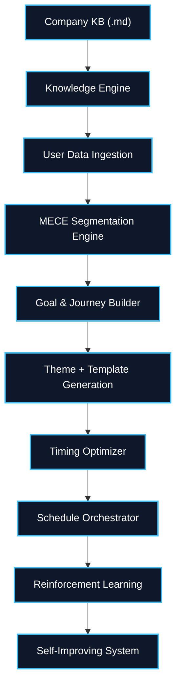

<div align="center">

# 🌌 Project Aurora
### Self-Learning Notification Orchestrator

</div>

<div align="center">

### 🚀 *AI-Powered Adaptive Engagement Intelligence System*

**🏆 Kriti 2026 - SpeakX Challenge**  

[🎥 Demo Video](https://drive.google.com/file/d/1c_yMBaIjrgGrG-4bzWlv0tDpM2K6HmWy/view?usp=drivesdk)

</div>

# ✨ Overview

**Project Aurora** is a **domain-agnostic, self-learning notification orchestration platform** that dynamically generates, optimizes, and evolves user engagement strategies using:

- 🧠 **Large Language Models**
- 📊 **Behavioral Analytics**
- 🎯 **Segmentation Intelligence**
- 🤖 **Reinforcement Learning**
- ⏰ **Timing Optimization**

Aurora ingests:

- 📄 Company Knowledge Banks (`.md/.txt`)
- 📈 User Behavioral Data (`.csv`)
- 🧪 Experiment Results

…and autonomously builds a **personalized multi-channel notification ecosystem** that continuously improves engagement performance over time.

---

# 🏗️ System Architecture

<div align="center">



</div>


# 🧩 Pipeline Breakdown

## 🧠 Task 1 — System Architecture & Intelligence Design

### 🔹 Knowledge Bank Engine *(Gemini 2.5 Flash)*

Extracts:

- North Star Metrics
- Feature → Goal mappings
- Tone & Hook matrices
- Propensity dimensions
- Journey templates
- Lifecycle progression structures

### 🔹 User Data Ingestion

Robust **5-layer validation pipeline**:

- ✅ Schema Validation
- ✅ Type Checking
- ✅ Range Validation
- ✅ Missing Value Imputation
- ✅ Deduplication

### 🔹 MECE Segmentation Engine

Advanced clustering pipeline using:

- 📊 **K-Means Clustering**
- 📈 **Silhouette Score Sweep (k = 6 → 12)**
- ⚖️ Lifecycle percentile normalization
- 🧬 KB-derived propensity dimensions:
  - Gamification
  - AI Tutor
  - Leaderboards
  - Social Interaction

### 🔹 Persona Generation

Dynamic 3-axis persona labeling:

```text
Dominant Trait × Activeness × Churn Risk
```

with iterative collision resolution.

### 🔹 Goal & Journey Builder

Generates:

- 🎯 Primary goals
- 🪜 Sub-goals
- 📅 Day-wise progression journeys
- 🔄 Lifecycle-aware engagement flows

---

# 💬 Task 2 — Communication & Timing Intelligence

### 🔹 Theme Engine *(Gemini)*

Maps the **Top-3 Octalysis motivational drives** for every segment.

### 🔹 Template Generator *(Gemini REST API)*

Generates:

- 🌐 Bilingual notifications *(English + Hindi)*
- ⚡ Concurrent batched inference
- 🧠 Segment-aware messaging
- 🎭 Theme-specific communication styles

### 🔹 Timing Optimizer

Compares multiple ML models:

| Model | Purpose |
|---|---|
| Random Forest | Time zone prediction |
| Gradient Boosting | Behavioral timing patterns |
| Logistic Regression | Baseline classification |
| SVM | Boundary optimization |

Outputs:

- ⏰ Top-3 optimal delivery windows
- 🌍 Segment-level timezone intelligence
- 👤 User-level notification timing

### 🔹 Schedule Generator *(Claude Sonnet)*

Builds intelligent schedules using:

- 🎯 Octalysis drive scoring
- 📈 Activeness-based notification frequency
- 📡 Multi-channel routing:
  - Push
  - In-App
  - WhatsApp
  - SMS
- 🧠 Template-to-notification optimization

---

# 🔁 Task 3 — Execution & Self-Learning

### 🔹 RL Classification Engine

Performs:

- 🧪 Reward-weight grid search
- 📊 Bayesian engagement estimation
- ⚖️ Quantile-based performance classification

Outputs:

```text
GOOD / NEUTRAL / BAD
```

with confidence gating.

### 🔹 Strategy Generator

Implements adaptive traffic allocation:

| Strategy Class | Allocation |
|---|---|
| GOOD | 70% |
| NEUTRAL | 25% |
| BAD | 5% |

Additional capabilities:

- 🚨 Uninstall guardrails
- 📉 Risk mitigation
- ⏰ Timing effectiveness analysis

### 🔹 Goal Updater *(Gemini)*

Adaptive 3-tier optimization strategy:

| Performance | Action |
|---|---|
| GOOD | Preserve |
| NEUTRAL | Generate A/B Variants |
| BAD | Rewrite Completely |

### 🔹 Iterative Regeneration

Aurora intelligently regenerates only:

- Changed templates
- Updated schedules
- RL-affected components

to minimize compute overhead.

### 🔹 Delta Report Generator

Creates detailed causal reports explaining:

- What changed
- Why it changed
- RL signals responsible
- Expected impact

---

# 🤖 Models & Technologies Used

## 🧠 LLMs

| Model | Usage |
|---|---|
| Gemini 2.5 Flash | KB extraction, optimization, template generation |
| Claude Sonnet 4.6 | Schedule generation & drive scoring |

## 📊 Machine Learning

| Library | Purpose |
|---|---|
| scikit-learn | Clustering & classification |
| pandas | Data processing |
| numpy | Numerical computation |
| scipy | Statistical utilities |
| joblib | Model persistence |

---

# ⚙️ Installation

## 📦 Prerequisites

```bash
pip install pandas numpy scikit-learn scipy joblib
pip install google-genai google-generativeai
pip install anthropic requests
```

---

# ▶️ Running the Pipeline

## 🚀 Run Complete Pipeline

```bash
python run_pipeline.py \
  --data user_behavioral_data.csv \
  --kb company_kb.md \
  --experiment experiment_results.csv
```

---

# 🧪 Run Individual Components

```bash
python codebase/task1_aurora.py
python codebase/theme_engine.py
python codebase/generate_templates.py
python codebase/timing_optimizer.py
python codebase/schedule_generator.py
python codebase/task3_learning_engine.py
python codebase/generate_delta_report.py
```

---

# 📂 Required Input Files

| File | Description |
|---|---|
| `user_behavioral_data.csv` | Behavioral dataset (1500 users) |
| `company_kb.md` | Company Knowledge Bank |
| `experiment_results.csv` | SpeakX Demo-2 experiment results |

---

# 🌟 Key Highlights

- 🧠 Fully AI-driven orchestration
- 🔁 Reinforcement learning feedback loop
- 🌍 Domain-agnostic architecture
- 📈 Self-improving engagement engine
- ⚡ Multi-model ML optimization
- 🌐 Multilingual notification generation
- 📡 Multi-channel intelligent delivery
- 🛡️ Safety-aware traffic allocation
- 📊 Explainable adaptive strategies

---

# 💻 Platform Compatibility

✅ Windows Compatible  
✅ Linux Compatible  
✅ Cross-platform path handling using `os.path.join()`  
✅ No Unix-specific dependencies

---

# 📌 Future Improvements

- 📱 Real-time notification streaming
- 🧠 Online reinforcement learning
- 🔔 Dynamic push prioritization
- 🎙️ Voice notification synthesis
- 🌎 Regional language expansion
- 📊 Live analytics dashboard
- ⚡ Kafka / Redis integration

---

<div align="center">

## 🌌 Aurora  
### *Notifications that learn, adapt, and evolve.*

</div>
